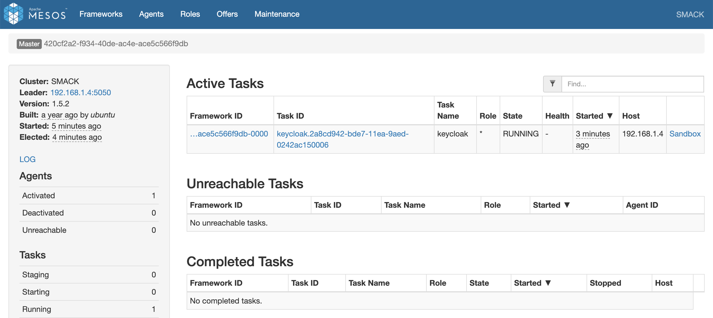

# springboot-mesos-marathon-keycloak-openldap

## Goal

The goal of this project is to create a simple REST API (`simple-service`) and secure it with
[`Keycloak`](https://www.keycloak.org), whose users will be loaded from [`OpenLDAP`](https://www.openldap.org) server.
Furthermore, we will start [`Mesos`](http://mesos.apache.org/) and [`Marathon`](https://mesosphere.github.io/marathon),
so that we can deploy `Keycloak` and `simple-service`.

## Start Environment

1. Open a terminal

2. Export the machine ip address to `HOST_IP_ADDR` environment variable.
> It can be obtained by executing `ifconfig` command on Mac/Linux terminal or `ipconfig` on Windows;
```
export HOST_IP_ADDR=...
```

3. Inside `/sprinboot-mesos-marathon-keycloak-openldap` root folder, run the following command
```
docker-compose up -d
```
> To stop and remove containers, networks, images, and volumes type:
> ```
> docker-compose down -v
> ```

## Deploy Keycloak to Marathon

1. Update the property `env.MYSQL_ADDR` that is present in `marathon/keycloak-MySQL.json`, informing machine ip address
(`echo $HOST_IP_ADDR`).

2. In `/sprinboot-mesos-marathon-keycloak-openldap` root folder, run
```
curl -X POST \
  -H "Content-type: application/json" \
  -d @./marathon/keycloak-MySQL.json \
  http://localhost:8090/v2/apps
```

3. Open `Marathon UI` and wait for `Keycloak` to be healthy: http://localhost:8090

4. You can follow `Keycloak` deployment logs on `Mesos`: http://localhost:5050



- On `Active Tasks` section, find the task `keycloak` and click on `Sandbox` (last link on the right).
- Then, click on `stdout`.
- A window will open and the logs will be displayed real-time.

5. Export to `KEYCLOAK_ADDR` environment variable the ip address and port provided by `Marathon` to `Keycloak`
```
export KEYCLOAK_ADDR=...
```

## Build simple-service Docker Image

In `/sprinboot-mesos-marathon-keycloak-openldap` root folder, run
```
mvn clean package docker:build
```

### Test Docker Image

1. Start container
```
docker run --rm -d \
  --name test-image \
  -p 8080:8080 \
  -e keycloak.auth-server-url=http://$KEYCLOAK_ADDR/auth \
  docker.mycompany.com/springboot-mesos-marathon-keycloak-openldap:1.0.0
```

2. Test `GET /api/public` endpoint
```
curl -i http://localhost:8080/api/public
```

It will return:
```
Code: 200
Response Body: It is public.
```

3. Stop container
```
docker stop test-image
```

## Configure OpenLDAP

Please, see https://github.com/ivangfr/springboot-keycloak-openldap#configuring-ldap

## Configure Keycloak

1. To open `Keycloak UI`, access the link
```
http://$KEYCLOAK_ADDR
```
OR you can open it using `Marathon UI`.

2. The next steps about configuring `Keycloak` can be seen at https://github.com/ivangfr/springboot-keycloak-openldap#configuring-keycloak

## Deploy simple-service to Marathon

1. Update the property `env.keycloak.auth-server-url` that is present in `marathon/simple-service.json`, informing
`Keycloak` ip address and port (`echo $KEYCLOAK_ADDR`).

2. Run the cURL command
```
curl -X POST http://localhost:8090/v2/apps \
  -H "Content-type: application/json" \
  -d @./marathon/simple-service.json
```

3. Open `Marathon UI` and wait for `simple-service` to be healthy: http://localhost:8090

The figure bellow shows `keycloak` and `simple-service` running on `Marathon`


4. Export to `SIMPLE_SERVICE_ADDR` environment variable the ip address and port provided by `Marathon` to `simple-service` application.
```
export SIMPLE_SERVICE_ADDR=...
```

## Testing simple-service using cURL

1. Try to access `GET /api/public` endpoint
```
curl -i "http://$SIMPLE_SERVICE_ADDR/api/public"
```

It will return:
```
Code: 200
Response Body: It is public.
```

2. Access `GET /api/private` endpoint (without authentication)
```
curl -i "http://$SIMPLE_SERVICE_ADDR/api/private"
```

It will return:
```
Code: 302
```

Here, the application is trying to redirect the request to an authentication link.

3. Export to `SIMPLESERVICE_CLIENT_SECRET` environment variable the _Client Secret_ created by `Keycloak` to `simple-service`. This secret was generated while configuring `Keycloak`.
```
export SIMPLE_SERVICE_CLIENT_SECRET=...
```

4. Get `bgates` access token
```
BGATES_ACCESS_TOKEN=$(curl -s -X POST \
  "http://$KEYCLOAK_ADDR/auth/realms/company-services/protocol/openid-connect/token" \
  -H "Content-Type: application/x-www-form-urlencoded" \
  -d "username=bgates" \
  -d "password=123" \
  -d "grant_type=password" \
  -d "client_secret=$SIMPLE_SERVICE_CLIENT_SECRET" \
  -d "client_id=simple-service" | jq -r .access_token)
```

5. Access `GET /api/private` endpoint this time, informing the access token
```
curl -i -H "Authorization: Bearer $BGATES_ACCESS_TOKEN" "http://$SIMPLE_SERVICE_ADDR/api/private"
```

It will return:
```
Code: 200
Response Body: bgates, it is private.
```
