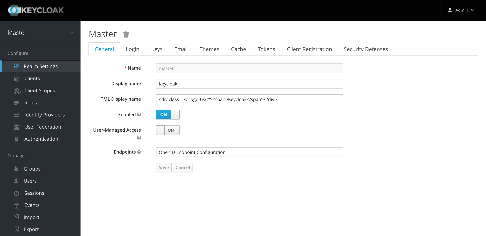
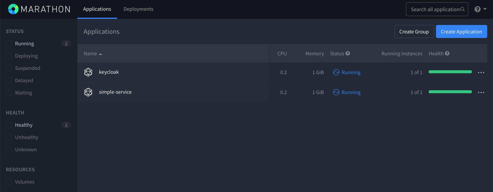

# `springboot-mesos-marathon-keycloak-openldap`

The goal of this project is to create a simple REST API, called `simple-service`, and secure it with
[`Keycloak`](https://www.keycloak.org). The API users will be loaded from [`OpenLDAP`](https://www.openldap.org) server.
Furthermore, we will start [`Mesos`](http://mesos.apache.org/) / [`Marathon`](https://mesosphere.github.io/marathon)
environment, so that we can deploy `Keycloak` and `simple-service` in it.

## Microservice

### simple-service

Spring-Boot Java Web application that exposes two endpoints:
- `/api/public`: endpoint that can be access by anyone, it is not secured;
- `/api/private`: endpoint that can just be accessed by users that provides a `JWT` token issued by `Keycloak` and the
token must contain the role `USER`.

## Start Environment

- Open a terminal

- Export the machine ip address to `HOST_IP_ADDR` environment variable.
> It can be obtained by executing `ifconfig` command on Mac/Linux terminal or `ipconfig` on Windows.
```
export HOST_IP_ADDR=...
```

- Inside `springboot-mesos-marathon-keycloak-openldap` root folder, run the following command
```
docker-compose up -d
```

- Wait a little bit until `zookeeper`, `mysql-keycloak` and `mesos-master` containers are Up (healthy)

- In order to check the status of the containers run the command
```
docker-compose ps
```

### Link of the Services

| Service    | URL                   |
| ---------- | --------------------- |
| `Mesos`    | http://localhost:5050 |
| `Marathon` | http://localhost:8090 |

## Deploy Keycloak to Marathon

- In `springboot-mesos-marathon-keycloak-openldap` root folder, run
```
curl -X POST \
  -H "Content-type: application/json" \
  -d @./marathon/keycloak.json \
  http://localhost:8090/v2/apps
```

- Open `Marathon`(http://localhost:8090) and wait for `Keycloak` to be healthy.

- You can monitor `Keycloak` deployment logs on `Mesos`(http://localhost:5050)


> - On `Active Tasks` section, find the task `keycloak` and click on `Sandbox` (last link on the right).
> - Then, click on `stdout`.
> - A window will open and the logs will be displayed real-time.

- Export to `KEYCLOAK_ADDR` environment variable the ip address and port provided by `Marathon` to `Keycloak`
```
export KEYCLOAK_ADDR="$(curl -s http://localhost:8090/v2/apps/keycloak | jq -r '.app.tasks[0].host'):$(curl -s http://localhost:8090/v2/apps/keycloak | jq '.app.tasks[0].ports[0]')"
echo $KEYCLOAK_ADDR
```

## Build simple-service Docker Image

In `springboot-mesos-marathon-keycloak-openldap` root folder, run
```
./mvnw clean package dockerfile:build -DskipTests --projects simple-service
```

### Test Docker Image

- Start container
```
docker run --rm -d \
  --name simple-service \
  -p 8080:8080 \
  -e keycloak.auth-server-url=http://$KEYCLOAK_ADDR/auth \
  docker.mycompany.com/simple-service:1.0.0
```

- To see the startup logs of `simple-service`, run the following command
```
docker logs simple-service -f
```

- Test `GET /api/public` endpoint
```
curl -i http://localhost:8080/api/public
```

It will return:
```
HTTP/1.1 200
It is public.
```

- Stop container
```
docker stop simple-service
```

## Import OpenLDAP Users

The `LDIF` file that we will use, `springboot-mesos-marathon-keycloak-openldap/ldap/ldap-mycompany-com.ldif`, contains
already a pre-defined structure for `mycompany.com`. Basically, it has 2 groups (`developers` and `admin`) and 4 users
(`Bill Gates`, `Steve Jobs`, `Mark Cuban` and `Ivan Franchin`). Besides, it is defined that `Bill Gates`, `Steve Jobs`
and `Mark Cuban` belong to `developers` group and `Ivan Franchin` belongs to `admin` group.
```
Bill Gates > username: bgates, password: 123
Steve Jobs > username: sjobs, password: 123
Mark Cuban > username: mcuban, password: 123
Ivan Franchin > username: ifranchin, password: 123
```

To import those users to `OpenLDAP` run the following script
```
./import-openldap-users.sh
```

## Configuring Keycloak



### Login

- To open `Keycloak UI`, access the link printed from the echo command below
```
echo "http://$KEYCLOAK_ADDR"
```
OR you can open it using `Marathon UI`.

- Login with the credentials
```
Username: admin
Password: admin
```

### Create a new Realm

- Go to top-left corner and hover the mouse over `Master` realm. A blue button `Add realm` will appear. Click on it.
- On `Name` field, write `company-services`. Click on `Create`.

### Create a new Client

- Click on `Clients` menu on the left.
- Click `Create` button.
- On `Client ID` field type `simple-service`.
- Click on `Save`.
- On `Settings` tab, set the `Access Type` to `confidential`.
- Still on `Settings` tab, set the `Valid Redirect URIs` to `http://localhost:8080`.
- Click on `Save`.
- Go to `Credentials` tab. Copy the value on `Secret` field. It will be used on the next steps.
- Go to `Roles` tab.
- Click `Add Role` button.
- On `Role Name` type `USER`.
- Click on `Save`.

### LDAP Integration

- Click on the `User Federation` menu on the left.
- Select `ldap`.
- On `Vendor` field select `Other`
- On `Connection URL` type `ldap://<ldap-host>`.

> `ldap-host` can be obtained running the following command on a terminal
> ```  
> docker inspect -f '{{range .NetworkSettings.Networks}}{{.IPAddress}}{{end}}' ldap-host
> ```

- Click on `Test connection` button, to check if the connection is OK.
- On `Users DN` type `ou=users,dc=mycompany,dc=com`
- On `Bind DN` type `cn=admin,dc=mycompany,dc=com`
- On `Bind Credential` set `admin`
- Click on `Test authentication` button, to check if the authentication is OK.
- On `Custom User LDAP Filter` set `(gidnumber=500)` to just get developers.
- Click on `Save`.
- Click on `Synchronize all users`.

### Configure users imported

- Click on `Users` menu on the left.
- Click on `View all users`. 3 users will be shown.
- Edit user `bgates`.
- Go to `Role Mappings` tab.
- Select `simple-service` on the combo-box `Client Roles`.
- Add the role `USER` to `bgates`.
- Do the same for the user `sjobs`.
- Let's leave `mcuban` without `USER` role.

## Deploy simple-service to Marathon

- Update the property `env.keycloak.auth-server-url` that is present in `marathon/simple-service.json`, informing
`Keycloak` ip address and port (`echo $KEYCLOAK_ADDR`).

- Run the `curl` command
```
curl -X POST http://localhost:8090/v2/apps \
  -H "Content-type: application/json" \
  -d @./marathon/simple-service.json
```

- Open `Marathon UI`(http://localhost:8090) and wait for `simple-service` to be healthy.

- You can monitor `simple-service` deployment logs on `Mesos`(http://localhost:5050)

The figure below shows `keycloak` and `simple-service` running on `Marathon`



- Export to `SIMPLE_SERVICE_ADDR` environment variable the ip address and port provided by `Marathon` to
`simple-service` application.
```
export SIMPLE_SERVICE_ADDR="$(curl -s http://localhost:8090/v2/apps/simple-service | jq -r '.app.tasks[0].host'):$(curl -s http://localhost:8090/v2/apps/simple-service | jq '.app.tasks[0].ports[0]')"
echo $SIMPLE_SERVICE_ADDR
```

## Testing simple-service

- Try to access `GET /api/public` endpoint
```
curl -i "http://$SIMPLE_SERVICE_ADDR/api/public"
```

It will return:
```
HTTP/1.1 200
It is public.
```

- Access `GET /api/private` endpoint (without authentication)
```
curl -i "http://$SIMPLE_SERVICE_ADDR/api/private"
```

It will return:
```
HTTP/1.1 302
```
> Here, the application is trying to redirect the request to an authentication link.

- Export to `SIMPLE_SERVICE_CLIENT_SECRET` environment variable the `Client Secret` created by `Keycloak` to
`simple-service`. This secret was generated while configuring the client in `Keycloak`.
```
export SIMPLE_SERVICE_CLIENT_SECRET=...
```

- Get `bgates` access token
```
BGATES_ACCESS_TOKEN=$(curl -s -X POST \
  "http://$KEYCLOAK_ADDR/auth/realms/company-services/protocol/openid-connect/token" \
  -H "Content-Type: application/x-www-form-urlencoded" \
  -d "username=bgates" \
  -d "password=123" \
  -d "grant_type=password" \
  -d "client_secret=$SIMPLE_SERVICE_CLIENT_SECRET" \
  -d "client_id=simple-service" | jq -r .access_token)
```

- Access `GET /api/private` endpoint this time, informing the access token
```
curl -i -H "Authorization: Bearer $BGATES_ACCESS_TOKEN" "http://$SIMPLE_SERVICE_ADDR/api/private"
```

It will return:
```
HTTP/1.1 200
bgates, it is private.
```

## Shutdown

- Go to `Marathon` and click on `keycloak` application;
- On the next page, click on the gear symbol and then on `Destroy`;
- Confirm the destroy of the application;
- Do the same for `simple-service` application;
- After that, go to a terminal and run
```
docker-compose down -v
docker rm -v $(docker ps -a -f status=exited -f status=created -q)
```
